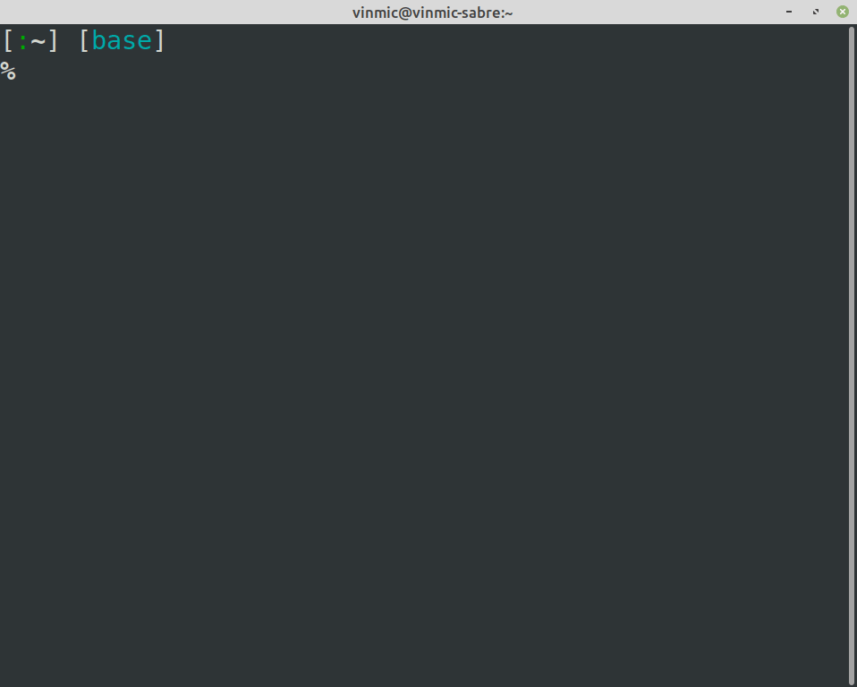

gambatte-terminal
-----------------

A terminal front-end for gambatte, the gameboy color emulator.




It supports:
- 16 colors, 256 colors and 24-bit colors terminal
- Playing audio from the emulator
- Using TAS input files as game input
- Using keyboard inputs via X11 as game input

Installation
------------

Wheels are available for linux, windows and osx and python 3.6, 3.7 and 3.8:

```shell
$ pip install gambaterm
```

Usage
-----

More information using the `--help` command:

```shell
$ python -m gambaterm --help
usage: gambaterm [-h] [--input-file INPUT_FILE] [--frame-advance FRAME_ADVANCE]
                 [--break-after BREAK_AFTER] [--speed-factor SPEED_FACTOR] [--force-gameboy]
                 [--skip-inputs SKIP_INPUTS] [--disable-audio] [--color-mode COLOR_MODE]
                 ROM

Gambatte terminal front-end

positional arguments:
  ROM                   Path to a GB or GBC rom file

optional arguments:
  -h, --help            show this help message and exit
  --input-file INPUT_FILE, -i INPUT_FILE
                        Path to a bizhawk BK2 file
  --frame-advance FRAME_ADVANCE, -fa FRAME_ADVANCE
                        Number of frames to run before showing the next one
  --break-after BREAK_AFTER, -ba BREAK_AFTER
                        Number of frames to run before forcing the emulator to stop
  --speed-factor SPEED_FACTOR, -sf SPEED_FACTOR
                        Speed factor to apply to the emulation
  --force-gameboy, -fg  Force the emulator to treat the rom as a GB file
  --skip-inputs SKIP_INPUTS, -si SKIP_INPUTS
                        Number of frame inputs to skip in order to compensate for the lack
                        of BIOS
  --disable-audio, -d   Disable audio entirely
  --color-mode COLOR_MODE, -c COLOR_MODE
                        Force a color mode (1: Greyscale, 2: 16 colors, 3: 256 colors, 4:
                        24-bit colors)
```
