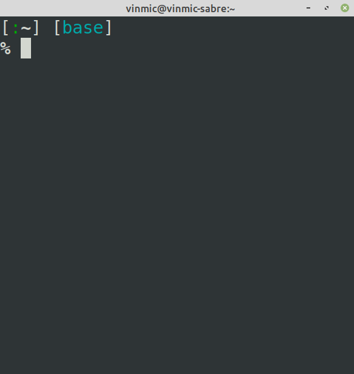

gambatte-terminal
-----------------

A terminal front-end for gambatte, the gameboy color emulator.




It supports:
- 16 colors, 256 colors and 24-bit colors terminal
- Playing audio from the emulator
- Using TAS input files as game input
- Using keyboard inputs via X11 as game input

Installation
------------

Wheels are available for linux, windows and osx and python 3.6, 3.7 and 3.8:

```shell
$ pip install gambaterm
```

Usage
-----

More information using the `--help` command:

```shell
$ python -m gambaterm --help
usage: gambaterm [-h] [--input-file INPUT_FILE] [--color-mode COLOR_MODE]
                 [--frame-advance FRAME_ADVANCE] [--frame-limit FRAME_LIMIT]
                 [--speed-factor SPEED_FACTOR] [--force-gameboy] [--disable-audio]
                 ROM

Gambatte terminal frontend

positional arguments:
  ROM

optional arguments:
  -h, --help            show this help message and exit
  --input-file INPUT_FILE, -i INPUT_FILE
  --color-mode COLOR_MODE, -c COLOR_MODE
  --frame-advance FRAME_ADVANCE, -a FRAME_ADVANCE
  --frame-limit FRAME_LIMIT, -l FRAME_LIMIT
  --speed-factor SPEED_FACTOR, -s SPEED_FACTOR
  --force-gameboy, -f
  --disable-audio, -d
```
