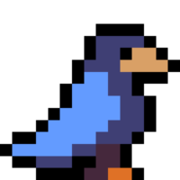
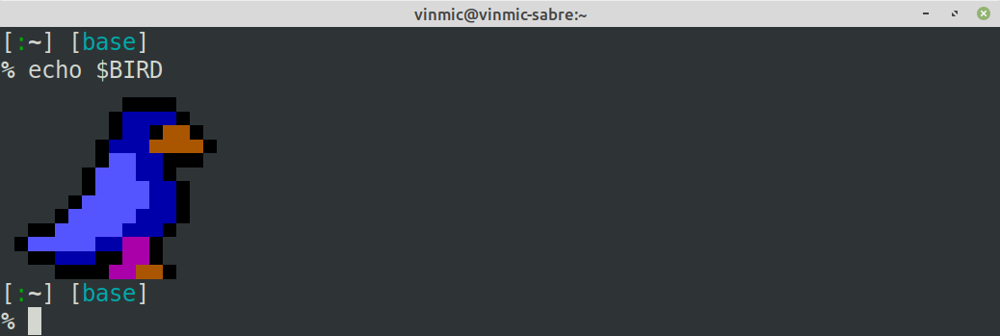
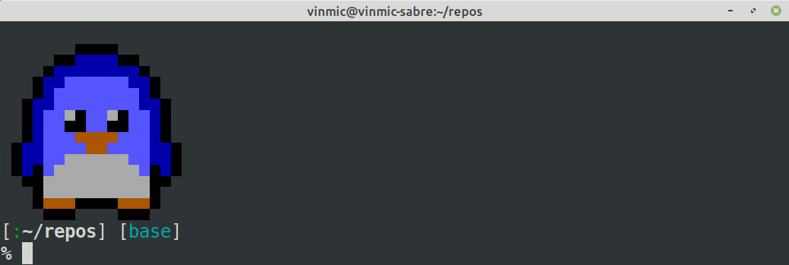

The [gambatte-terminal][gambatte-terminal] project, or [gambaterm][gambaterm], is a terminal frontend for the [gambatte][gambatte] game boy color emulator.

This write-up goes into all the interesting piece of information I ran into while developing this project. It is about old video game consoles, terminal emulation, pixels within unicode characters, SSH-based terminal applications, tool-assisted speedruns and the definition of a frame.

<p align="center">

</p>

# Introduction
{:.no_toc}

Last year I was talking to a friend about how powerful modern terminal emulators actually are, and how easy it is to serve full-screen terminal applications over SSH using the [asyncssh][asyncssh] and [prompt-toolkit][prompt-toolkit] python libraries. At some point, the question of the feasibility of serving retro games directly in the terminal came up and I went on an investigation to try and see how far this idea could be pushed.

This write up goes through the interesting bits of information that I gathered and the limits I faced while attempting this challenge. It's a lot of information about unrelated stuff so instead of stitching everything together in consistent way, I gave up and simply dumped below the pieces of info I had in my mind, in the form of answers to questions that probably no one will ever ask me. My advice to you as a reader is to simply scroll and stop if something catch your eye.

So buckle up, we're going to talk about old video game consoles, terminal emulation, pixels within unicode characters, SSH-based terminal applications, tool-assisted speedruns and the definition of a frame. Let's go.

## Wait, are you saying I can play Game Boy Color games in my terminal?
{:.no_toc}

Exactly!\* If you don't care about the details and just want to play around with an in-terminal Game Boy Color emulator, simply run `pip3 install gambaterm` and head to the [gambatte-terminal repository][gambatte-terminal] for more information.

<sub>\*: If you're running MacOS, you probably want to use [iterm2][iterm2].</sub>
<br>
<sub>\*: If you're running Windows, you probably want to <s>give up now</s> read [this section][terminal support].</sub>

## And that I can expose those games through SSH?
{:.no_toc}

Somehow yes, but there are some security concerns that come with that. Check out the [relevant section][ssh-server].

What you can safely do though is expose tool-assisted speedruns over SSH, like this amazing [GBC The Legend of Zelda: Link's Awakening DX (USA v1.0) in 27:55.02 by TwistedTammer](http://tasvideos.org/4017M.html). Try it out by connecting to my demo server:

```bash
ssh gambaterm.vxgmichel.xyz
# When prompted for a password, use `not@bot`
# Resize the terminal font if necessary, typically with `ctrl -` or `ctrl mouse-wheel`
# Don't expect any sound, audio can't really be streamed through SSH :(
```

## Is that useful?
{:.no_toc}

Absolutely not.


# Table of content
{:.no_toc}

<nav>
  * this unordered seed list will be replaced by toc as unordered list
  {:toc}
</nav>

# About rendering pixels

Now let's dive straight into the fun stuff, pixels \o/

## How do you draw pixels in a terminal?

There are a couple of ways to display pixels in a terminal, but I'll detail here the thought process behind my favorite approach.

So let's say we want to leverage the fact that modern terminals support colors. As seen in the [ANSI escape code][ANSI escape code] reference, the colors are either applied as **background** or **foreground** colors. This means a single character can only display up to two different colors. And since typical **monospaced** fonts have a width to height ratio between 50% and 60%, a monospaced character makes a very good candidate for mapping two vertically aligned pixels. Now all we need is a character that fills up exactly half of its space, and luckily there are two of them:

- `U+2580 |▀|`: "Upper half block" from the [Block elements][block elements] Unicode block
- `U+2584 |▄|`: "Lower half block" from the [Block elements][block elements] Unicode block

For the sake of completeness, let's add:

- `U+2588 |█|`: "Full block" from the [Block elements][block elements] Unicode block
- `U+0020 | |`: Space from the Basic Latin Unicode block

For a given foreground/background combination, all colors combinations are then available (i.e `FF`, `BB`, `BF` and `FB`). This means the **"brush"** has to be changed only when a new color appears, which is quite convenient for later optimization.

This technique gives very nice results in most terminals (more on that later) and so far I've only seen it used in the [PIXterm project][pixterm]. I've also used it in [this gist][pokesprite] which fetches and displays pokemon sprites in the terminal.

## Then draw me a something!

OK, maybe that was a bit fast. Let's take it step by step and consider this cool bird sprite from [Celeste](celeste):

<p align="center">

</p>

It is 13x15 pixels in size, so let's add an extra transparent row and column on the upper and left borders to even things out. Here's the list of the **"commands"** available to us that we can send to the terminal through `stdout`:

- `\u2580` / `\u2584`: draw upper / lower half block (encoded as UTF-8)
- `\u2588` / `\u0020`: draw full / empty block (encoded as UTF-8)
- `\e[30m` / `\e[40m`: set black as foreground / background color
- `\e[33m` / `\e[43m`: set yellow as foreground / background color
- `\e[34m` / `\e[44m`: set blue as foreground / background color
- `\e[35m` / `\e[45m`: set magenta as foreground / background color
- `\e[94m` / `\e[104m`: set bright blue as foreground / background color
- `\e[m`: reset foreground and background colors (useful for transparency)
- `\r\n`: cross-platform line feed

The first row is all transparent and the second row is 9 transparent pixels followed by 4 black pixels. Those two rows can then be drawn using the following command:
```bash
echo "\u0020\u0020\u0020\u0020\u0020\u0020\u0020\u0020\u0020\e[30m\u2584\u2584\u2584\u2584"
```
The next two rows are all transparent for 8 pixels, both followed by a black pixel. Now remember that our brush is still set as black over transparent, which means we can draw the two black pixels as full block without having to set a new color:

```bash
echo """\
\u0020\u0020\u0020\u0020\u0020\u0020\u0020\u0020\u0020\e[30m\u2584\u2584\u2584\u2584\r
\u0020\u0020\u0020\u0020\u0020\u0020\u0020\u0020\u0088"""
```
Now a block of 4 blue pixels needs to be drawn. Let's keep the black color available by changing the background color to blue:
```bash
printf """\
\u0020\u0020\u0020\u0020\u0020\u0020\u0020\u0020\u0020\e[30m\u2584\u2584\u2584\u2584\r
\u0020\u0020\u0020\u0020\u0020\u0020\u0020\u0020\u2588\e[44m\u0020\u0020"""
```
The next two pixels are blue up and black down. Both colors are already set in our current brush, so all we need is a lower block:
```bash
printf """\
\u0020\u0020\u0020\u0020\u0020\u0020\u0020\u0020\u0020\e[30m\u2584\u2584\u2584\u2584\r
\u0020\u0020\u0020\u0020\u0020\u0020\u0020\u0020\u2588\e[44m\u0020\u0020\u2584"""
```
The next two pixels are blue up and yellow down. Let's replace our black foreground with yellow and print another lower block:
```bash
printf """\
\u0020\u0020\u0020\u0020\u0020\u0020\u0020\u0020\u0020\e[30m\u2584\u2584\u2584\u2584\r
\u0020\u0020\u0020\u0020\u0020\u0020\u0020\u0020\u2588\e[44m\u0020\u0020\u2584\e[33m\u2584"""
```

By repeating this process, the following command is obtained:
```bash
BIRD=`printf """\
\u0020\u0020\u0020\u0020\u0020\u0020\u0020\u0020\u0020\e[30m\u2584\u2584\u2584\u2584\r
\u0020\u0020\u0020\u0020\u0020\u0020\u0020\u0020\u2588\e[44m\u0020\u0020\u2584\e[33m\u2584\e[40m\u2584\e[m\e[30m\u2584\r
\u0020\u0020\u0020\u0020\u0020\u0020\u0020\u2588\e[44m\e[94m\u2584\u2584\u0020\e[33m\u2580\e[40m\u2580\u2580\u2580\e[m\e[30m\u2580\r
\u0020\u0020\u0020\u0020\u0020\u0020\u2588\e[104m\u0020\u0020\u0020\e[34m\u2580\u2588\e[40m\u2584\e[m\e[30m\u2584\r
\u0020\u0020\u0020\u0020\u2584\e[104m\u2580\u0020\u0020\u0020\u0020\e[34m\u2584\u2588\u2588\e[m\e[30m\u2588\r
\u0020\u2584\e[104m\u2580\u2580\u0020\u0020\u0020\e[34m\u2584\u2584\e[45m\u2580\u2580\e[40m\u2580\e[m\e[30m\u2580\r
\u0020\u0020\u2580\u2580\e[44m\u2584\u2584\u2584\u2588\e[45m\u2580\u0020\e[33m\u2584\e[40m\u2584\e[m\e[30m\u2584\e[m\
"""`
```



## That's not too many bytes, does it fit in a tweet?

This sequence is 358 bytes long but can be [compressed](https://linux.die.net/man/1/gzip) to less than 150 bytes:
```bash
echo $BIRD | wc -c
364
echo $BIRD | gzip | wc -c
146
echo $BIRD | gzip | base64 -w0 | wc
196
```

This is less than 200 bytes in base64, which means this lovely bird does fit in a tweet:
```bash
echo H4sIAAAAAAAAA32QwQ3AIAgA/yadwA8j2JQ+OoszsIOPPpigA3aSgoiaJq0hkcidoABtxbwluq+zxxK8dF8cMyJpdgq3Ud0x2U6udsOFmA9sd0LzSvOKxbCL21Vek7ZTCQ3mz371THnhYDjSlKvmOAs+s4YPWl+0k49lQ77G60Wcf4pdhJ+/kTQ8gw4GvWwBAAA= | base64 -d | gzip -d
```

Now go [tweet this suspicious command with its arbitrary payload](http://twitter.com/home?status=echo%20H4sIALg0LWAAA32QwQ3AIAgA%2FyadwA8j2JQ%2BOoszsIOPPpigA3aSgoiaJq0hkcidoABtxbwluq%2BzxxK8dF8cMyJpdgq3Ud0x2U6udsOFmA9sd0LzSvOKxbCL21Vek7ZTCQ3mz371THnhYDjSlKvmOAs%2Bs4YPWl%2B0k49lQ77G60Wcf4pdhJ%2B%2FkTQ8gw4GvWwBAAA%3D%20%7C%20base64%20-d%20%7C%20pigz%20-d), I'm sure it's all fine ~

Also, here's a penguin that you can put in your `.bashrc`:
```bash
echo H4sIAAAAAAAAA31RwQ3AIAj8u4IfR7CRpOkszuAOPvpwgg7YSXqCUh62hgTj3XGALvTjc4rlvk6Ez0S4Vg2fi4Ed2IYF5UEDsjErWrVbKtsyPvWN9YC3iIRMu9i3/yckfihOhzWdCK0jSWaXNmqY2mU72g0Xk2mGe+W1BqnFiuF2ahtac6qCHqFMXFYOa0rvpg1ufuqD0f0eFpHJyekBAAA= | base64 -d | gzip -d
```



## What size is the gameboy screen? Will it fit in my terminal?

The gameboy screen is 160 pixels in width for 144 pixels in height, meaning the terminal windows has to display at least 72 lines of 160 characters. On my linux system by default, the gnome-terminal on a 1080p full-screen is 52 rows of 191 characters which is not enough to display the gameboy screen entirely.

After hitting the "decrease size" shortcut twice however, the gnome terminal is then 75 rows of 274 characters, which is perfect for displaying the full gameboy screen. Each gameboy pixel is then represented by a square of 7x7 pixels. Hitting "decrease size" twice more gives 104 rows of 191 characters when the terminal is resized to half the screen, which is another good configuration to play games (this gives gameboy pixels of 5x5 screen pixels). It is possible to hit the "decrease size" shortcut three times more to reach the minimum size, which alternatively represents gameboy pixels as 3x3 and 3x4 pixels on screen.

| Number of decrease | Size in full-screen | Size in half-screen | Gameboy pixel size |
|--------------------|---------------------|---------------------|--------------------|
| 0                  | 191x52 (too small)  | 95x52 (too small)   | 10x10              |
| 1                  | 239x61 (too small)  | 119x61 (too small)  | 8x8 and 8x9        |
| 2                  | 274x75              | 136x75 (too small)  | 7x7                |
| 3                  | 319x87              | 159x87 (too small)  | 6x6                |
| 4                  | 383x105             | 191x104             | 5x5                |
| 5                  | 479x116             | 239x116             | 4x4  and 4x5       |
| 6                  | 639x131             | 319x131             | 3x4                |
| 7                  | 639x150             | 319x150             | 3x3  and 3x4       |

Note that the project supports resizing at runtime, meaning the video output will always be cropped or centered depending on the current terminal size. A good way to deal with size is then to launch the emulator and then adapt the size so it feels comfortable. The keyboard shortcuts are typically `ctrl -`, `ctrl +` or `ctrl wheel`.

## But isn't it a lot of data when rendering at 60 FPS?

Assuming the following data:
- about 3 bytes per double pixel for the unicode character (ignoring that the space is only one byte)
- about 1 color change every 6 character (1 new color every 12 pixels)
- about 10 bytes for setting one new color in 256-color mode
- about 18 bytes for setting one new color in 24-bit color mode

We get:
- `6 * 3 + 10 = 16` bytes for 12 pixels, i.e **2.3 bytes per pixel** in 256-color mode
- `6 * 3 + 18 = 24` bytes for 12 pixels, i.e **3 bytes per pixel** in 24-bit color mode

Note that those assumptions really depends on the image that is being processed, the most important criteria being the level of details which directly correlates to the number of color change necessary. A video frame of one solid color would approach 0.5 byte per pixel while a checker board of 4 different colors in 24-bit color mode would be about 40 bytes per pixels.

Remember however that the Game Boy Color displays at most 56 colors at once (ignoring the Hi-Color mode), so large solid areas will often appears in video frames during gameplay. Considering this, the assumption of 1 color change every 6 characters seems acceptable; I actually measured 1 color change every 6.7 characters using the first 5 minutes of gameplay of the 2019 TAS of Link's Awakening DX.

Things can be optimized a bit further by preferring the space character (` `) over the full block (`█`) since it's only one byte (compared to 3). My final measurements gives:
- **1.8 bytes per pixels** in 256-color mode
- **2.2 bytes per pixels** in 24-bit color mode

Note that 2 bytes per pixel for a 160x144 screen at 60 FPS yields a data rate of 2.6 MiB per second, which is still a lot of data. But we have one more trick up our sleeves! We have to notice that very little actually changes from one frame to another: some sprites might move by a few pixels, but the overall picture usually remains the same.

That means we can compare the old frame to the new one and see which character needs to be updated. When a character is unchanged, we simply look for the next character that does change. Note that we can easily move our cursor to a given position using the following ANSI codes:
- `\e[nA`: Move the cursor up by `n` lines
- `\e[nB`: Move the cursor down by `n` lines
- `\e[nC`: Move the cursor forward by `n` characters
- `\e[nD`: Move the cursor back by `n` characters
- `\e[n;mH`: Move the cursor the the line `n`, character `m`

With this optimizations, my Link's Awakening measurements yield:
- about **300 KiB/s** in 256-color mode
- about **400 KiB/s** in 24-bit color mode

This is much better! An exception to our assumption of subsequent frames being similar is screen transitions, since most of the screen changes at this time. This is however not much of problem since those transitions are quite rare compare to regular gameplay and typically last a couple of frame. It's a short sporadic burst of data that is quickly absorbed by the regular game flow.

## That's a lot of computation, isn't it slow?

The whole video buffer to ANSI output conversion can be done by a single iteration over every pair of vertically aligned pixels, i.e `O(n)` where `n` is `160 * 144 // 2 = 11520`. Running this 60 times per seconds is not a big deal, especially if the output buffer is pre-allocated and the routine is written in a fast language like [Cython][cython].

I ended up writing a dedicated cython extension module called [termblit](https://github.com/vxgmichel/gambatte-terminal/blob/master/termblit_ext/termblit.pyx) that exposes the conversion function as `gambaterm.termblit.blit`, which is generic enough to be used in other projects. In the case of gambaterm, the conversion typically runs in 250 microsecond and can go up to 1 millisecond during screen transitions. That means it shouldn't exceed 6% of the load of a single CPU core.

In my experience, the most CPU intensive part of running this project is not the video conversion nor the emulator but the processing and rendering of the video stream on the terminal side. Terminals are understandably not optimized for this use case and while some do a really good job at dealing with such large amount and weird kind of data, others will slow down to the point where the gameboy 60 FPS frame rate can't be maintained and frames have to be dropped.

## What about using Braille dot as pixel?

Indeed, the similar [php-terminal-gameboy-emulator][php-terminal-gameboy-emulator] project uses the [Braille Pattern Unicode block][Braille Patterns] to map each character in the terminal to a 2 by 4 pixels rectangle. This is a really interesting idea as each pixel can be controlled independently:

```python
>>> for x in range(16): print("|", " | ".join(chr(0x2800 + 16 * x + y) for y in range(16)), "|")
| ⠀ | ⠁ | ⠂ | ⠃ | ⠄ | ⠅ | ⠆ | ⠇ | ⠈ | ⠉ | ⠊ | ⠋ | ⠌ | ⠍ | ⠎ | ⠏ |
| ⠐ | ⠑ | ⠒ | ⠓ | ⠔ | ⠕ | ⠖ | ⠗ | ⠘ | ⠙ | ⠚ | ⠛ | ⠜ | ⠝ | ⠞ | ⠟ |
| ⠠ | ⠡ | ⠢ | ⠣ | ⠤ | ⠥ | ⠦ | ⠧ | ⠨ | ⠩ | ⠪ | ⠫ | ⠬ | ⠭ | ⠮ | ⠯ |
| ⠰ | ⠱ | ⠲ | ⠳ | ⠴ | ⠵ | ⠶ | ⠷ | ⠸ | ⠹ | ⠺ | ⠻ | ⠼ | ⠽ | ⠾ | ⠿ |
| ⡀ | ⡁ | ⡂ | ⡃ | ⡄ | ⡅ | ⡆ | ⡇ | ⡈ | ⡉ | ⡊ | ⡋ | ⡌ | ⡍ | ⡎ | ⡏ |
| ⡐ | ⡑ | ⡒ | ⡓ | ⡔ | ⡕ | ⡖ | ⡗ | ⡘ | ⡙ | ⡚ | ⡛ | ⡜ | ⡝ | ⡞ | ⡟ |
| ⡠ | ⡡ | ⡢ | ⡣ | ⡤ | ⡥ | ⡦ | ⡧ | ⡨ | ⡩ | ⡪ | ⡫ | ⡬ | ⡭ | ⡮ | ⡯ |
| ⡰ | ⡱ | ⡲ | ⡳ | ⡴ | ⡵ | ⡶ | ⡷ | ⡸ | ⡹ | ⡺ | ⡻ | ⡼ | ⡽ | ⡾ | ⡿ |
| ⢀ | ⢁ | ⢂ | ⢃ | ⢄ | ⢅ | ⢆ | ⢇ | ⢈ | ⢉ | ⢊ | ⢋ | ⢌ | ⢍ | ⢎ | ⢏ |
| ⢐ | ⢑ | ⢒ | ⢓ | ⢔ | ⢕ | ⢖ | ⢗ | ⢘ | ⢙ | ⢚ | ⢛ | ⢜ | ⢝ | ⢞ | ⢟ |
| ⢠ | ⢡ | ⢢ | ⢣ | ⢤ | ⢥ | ⢦ | ⢧ | ⢨ | ⢩ | ⢪ | ⢫ | ⢬ | ⢭ | ⢮ | ⢯ |
| ⢰ | ⢱ | ⢲ | ⢳ | ⢴ | ⢵ | ⢶ | ⢷ | ⢸ | ⢹ | ⢺ | ⢻ | ⢼ | ⢽ | ⢾ | ⢿ |
| ⣀ | ⣁ | ⣂ | ⣃ | ⣄ | ⣅ | ⣆ | ⣇ | ⣈ | ⣉ | ⣊ | ⣋ | ⣌ | ⣍ | ⣎ | ⣏ |
| ⣐ | ⣑ | ⣒ | ⣓ | ⣔ | ⣕ | ⣖ | ⣗ | ⣘ | ⣙ | ⣚ | ⣛ | ⣜ | ⣝ | ⣞ | ⣟ |
| ⣠ | ⣡ | ⣢ | ⣣ | ⣤ | ⣥ | ⣦ | ⣧ | ⣨ | ⣩ | ⣪ | ⣫ | ⣬ | ⣭ | ⣮ | ⣯ |
| ⣰ | ⣱ | ⣲ | ⣳ | ⣴ | ⣵ | ⣶ | ⣷ | ⣸ | ⣹ | ⣺ | ⣻ | ⣼ | ⣽ | ⣾ | ⣿ |
```

A nice advantage with this approach is that pixels end up being quite small, meaning you can draw many of them without having to change the size of the terminal. If we consider a typical resolution of 100 columns for 50 lines, the Braille approach gives a 200x200 monochrome canvas to plays with.

There are two drawbacks though:
- Each pixel is either on or off, there is no room for shades or colors. Note that the original gameboy has a grayscale of 4 shades (black, dark gray, light gray and white), so half of the information is lost here.
- Those characters don't give the impression of a smooth grid when they're next to each other because the spacing is inconsistent: `⣿⣿`.


# Coming up next...
{:.no_toc}

More Q&A about:
- pretty colors
- input handling
- terminal applications
- serving terminal apps through SSH
- the gambatte emulator
- the project overall


[gambatte-terminal]: https://github.com/vxgmichel/gambatte-terminal
[gambaterm]: https://pypi.org/project/gambaterm/
[gambatte]: https://github.com/sinamas/gambatte
[asyncssh]: https://github.com/ronf/asyncssh
[prompt-toolkit]: https://github.com/prompt-toolkit/python-prompt-toolkit
[gambatte-terminal]: https://github.com/vxgmichel/gambatte-terminal
[iterm2]: https://iterm2.com/
[terminal support]: https://github.com/vxgmichel/gambatte-terminal#terminal-support
[ssh-server]: https://github.com/vxgmichel/gambatte-terminal#ssh-server

[php-terminal-gameboy-emulator]: https://github.com/gabrielrcouto/php-terminal-gameboy-emulator
[Braille Patterns]: https://en.wikipedia.org/wiki/Braille_Patterns
[pixterm]: https://github.com/eliukblau/pixterm
[ANSI escape code]: https://en.wikipedia.org/wiki/ANSI_escape_code
[block elements]: https://en.wikipedia.org/wiki/Block_Elements
[pokesprite]: https://gist.github.com/vxgmichel/80fca9bd3220f45e0fb2ea0d3167ccb3
[celeste]: http://www.celestegame.com/
[cython]: https://cython.org/
